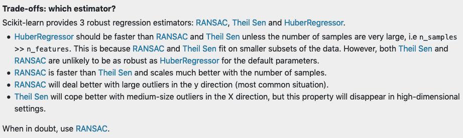
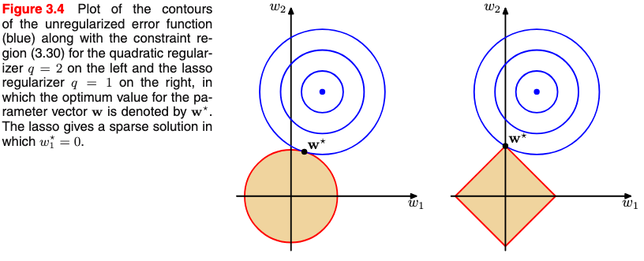
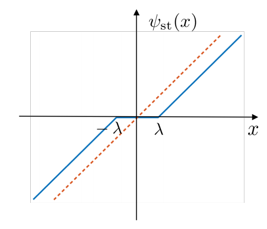

# Notes on Regularization and Bayesian Modeling

Avant Knowledge Sharing Session on 1/7/2019, Tuesday

- [Notes on Regularization and Bayesian Modeling](#notes-on-regularization-and-bayesian-modeling)
  - [1. Regularized (Linear) Regression](#1-regularized-linear-regression)
  - [2. Scikit-learn: Liner Models](#2-scikit-learn-liner-models)
    - [2.1. LASSO](#21-lasso)
    - [2.2. ElasticNet](#22-elasticnet)
    - [2.3. Least Angle Regression](#23-least-angle-regression)
    - [2.4. Orthogonal Matching Pursuit](#24-orthogonal-matching-pursuit)
    - [2.5. Bayesian Regression](#25-bayesian-regression)
    - [2.6. Automatic Relevance Determination (ARD)](#26-automatic-relevance-determination-ard)
    - [2.7. Logistic Regression](#27-logistic-regression)
    - [2.8. Robustness regression: outliers and modeling errors](#28-robustness-regression-outliers-and-modeling-errors)
      - [2.8.1. Random sample consensus (RANSAC)](#281-random-sample-consensus-ransac)
      - [2.8.2. Theil-Sen](#282-theil-sen)
      - [2.8.3. Huber regression](#283-huber-regression)
      - [2.8.4. Notes](#284-notes)
    - [2.9. Polynomial regression: extending linear models with basis functions](#29-polynomial-regression-extending-linear-models-with-basis-functions)
  - [3. Selected sections of the Bishop's.](#3-selected-sections-of-the-bishops)
    - [3.1 Linear basis function models (sec. 3.1, pp. 138 - 146)](#31-linear-basis-function-models-sec-31-pp-138---146)
      - [3.1.1. Linear models and maximum likelihood](#311-linear-models-and-maximum-likelihood)
      - [3.1.2. Regularized least squares](#312-regularized-least-squares)
    - [3.2 Bayesian linear regression (sec. 3.3 pp. 152)](#32-bayesian-linear-regression-sec-33-pp-152)
      - [3.2.1 Bayes rule and Gaussian conjugate prior](#321-bayes-rule-and-gaussian-conjugate-prior)
      - [3.2.2 Bayesian linear regression](#322-bayesian-linear-regression)
  - [4. More on LASSO](#4-more-on-lasso)
    - [4.1. Coordinate descent (CD)](#41-coordinate-descent-cd)
      - [4.1.1. When does coordinate-wise minimization work?](#411-when-does-coordinate-wise-minimization-work)
    - [4.2 Algorithms for solving LASSO](#42-algorithms-for-solving-lasso)
      - [4.2.1. Subgradients and univariate LASSO](#421-subgradients-and-univariate-lasso)
      - [4.2.2 Coordinate descent for multivariate LASSO](#422-coordinate-descent-for-multivariate-lasso)
      - [4.2.3. LARS](#423-lars)
      - [4.2.3. References for LASSO algorithms](#423-references-for-lasso-algorithms)
    - [4.3 Bayesian interpretation of LASSO](#43-bayesian-interpretation-of-lasso)
  - [References](#references)

## 1. [Regularized (Linear) Regression](http://uc-r.github.io/regularized_regression)

- Why regularization?
  - *Multicollinearity*. Coefficients for correlated features become over-inflated and can fluctuate significantly.  
  - *Insufficient Solution*. When $p > n$, the [solution matrix](https://en.wikipedia.org/wiki/Projection_matrix) (i.e., $\hat{\beta} =[(X^TX)^{-1}X^T]Y$) is non-invertible, which leads to non-unique solutions.
  - *Interpretability*. A smaller subset of strong features are usually preferred.
- [Ridge Regression](https://en.wikipedia.org/wiki/Tikhonov_regularization)
  - pushing correlated features towards each other rather than allowing for one to be wildly positive and the other wildly negative (as would have happened in OLS with correlated features). Reducing noice and identifying true signals in the model effects.
  - However, a ridge model will retain all variables. 
- [LASSO (least absolute shrinkage and selection operator)](https://en.wikipedia.org/wiki/Lasso_(statistics)) 
  - Similar to ridge, lasso pushes many collinear features towards each other rather than allowing for one to be wildly positive and the other negative. But lasso actually pushes coefficients to zero so it can be used for feature selection.
- Elastic Nets
  - The advantages of elastic net model is that it enables effective regularization via ridge penalty, and with feature selection characteristics of the lasso penalty.
- Alternatives
  - e.g., *Least Angle Regression*, *Bayesian Lasso*.

## 2. [Scikit-learn: Liner Models](https://scikit-learn.org/stable/modules/linear_model.html)

### 2.1. LASSO
- Example [Lasso model selection: Cross-Validation / AIC / BIC](https://scikit-learn.org/stable/auto_examples/linear_model/plot_lasso_model_selection.html#sphx-glr-auto-examples-linear-model-plot-lasso-model-selection-py)
- [LassoLarsIC](https://scikit-learn.org/stable/modules/generated/sklearn.linear_model.LassoLarsIC.html#sklearn.linear_model.LassoLarsIC) uses the Akaike information criterion (AIC) and the Bayes Information criterion (BIC) for model selection. It's computationally cheaper than using cross validation but assumes that the model is correct, i.e. that the data are actually generated by this model. Information-creteria based methods also tend to break when the problem is badly conditioned (e.g., more features than the number of samples).
- [MultiTaskLasso](https://scikit-learn.org/stable/modules/generated/sklearn.linear_model.MultiTaskLasso.html#sklearn.linear_model.MultiTaskLasso) is a model that estimates sparse coefficients for multiple regression problems jointly. The constraint is that the selected features are the same for all the regression problems, also called tasks. ***Is it gonna be useful for EDA in a multi-task setting?***

### 2.2. ElasticNet
- A similar suite of functions are available in scikit-learn, see [Lasso and Elastic Net for Sparse Signals](https://scikit-learn.org/stable/auto_examples/linear_model/plot_lasso_and_elasticnet.html#sphx-glr-auto-examples-linear-model-plot-lasso-and-elasticnet-py) and [MultiTaskElasticNet](https://scikit-learn.org/stable/modules/generated/sklearn.linear_model.MultiTaskElasticNet.html#sklearn.linear_model.MultiTaskElasticNet).

### 2.3. [Least Angle Regression](https://en.wikipedia.org/wiki/Least-angle_regression)
-  Similar to forward stepwise regression. At each step, it finds the feature most correlated with the target. When there are multiple features having equal correlation, instead of continuing along the same feature, it proceeds in a direction *equiangular* between the features.
-  [Pros and cons](https://en.wikipedia.org/wiki/Least-angle_regression#Pros_and_cons), and [step-by-step algorithm](https://en.wikipedia.org/wiki/Least-angle_regression#Algorithm).
-  [LassoLars](https://scikit-learn.org/stable/modules/generated/sklearn.linear_model.LassoLars.html#sklearn.linear_model.LassoLars) a lasso model implemented using the LARS algorithm as opposed to the implementation based on coordinate descent.

### 2.4. [Orthogonal Matching Pursuit](https://scikit-learn.org/stable/modules/linear_model.html#orthogonal-matching-pursuit-omp)
-  Example: [Sparse Signal Recovery With Orthogonal Matching Pursuit](https://scikit-learn.org/stable/auto_examples/linear_model/plot_omp.html#sphx-glr-auto-examples-linear-model-plot-omp-py)

$$\arg \min _\beta ||y - X\beta||_2^2 \quad \text{s.t.} \quad ||\beta||_0 \leq n_{\text{non-negative-coeff}}$$

-  OMP algorithm can be used for approximating the fit of a linear model with constraints imposed on the number of non-zero coefficients. 

### 2.5. [Bayesian Regression](https://scikit-learn.org/stable/modules/linear_model.html#bayesian-regression)
- [BayesianRidge](https://scikit-learn.org/stable/modules/generated/sklearn.linear_model.BayesianRidge.html#sklearn.linear_model.BayesianRidge) estimates a probabilistic model of the regression problem, with the prior distribution of the coefficients being $p(\omega|\lambda) = \mathcal{N}(\omega | 0, \lambda^{-1}\mathbf{I}_p)$, and $\alpha$ and $\gamma$ are chosen to follow the [Gamma distribution](https://en.wikipedia.org/wiki/Gamma_distribution) (conjugate prior for the precision of the Gaussian).
- Noted that in the Bayesian framework, hyperparameters are associated with parameters to the prior (i.e., Gamma, Gaussian) distributions.
- Example - [Curve Fitting with Bayesian Ridge Regression](https://scikit-learn.org/stable/auto_examples/linear_model/plot_bayesian_ridge_curvefit.html#sphx-glr-auto-examples-linear-model-plot-bayesian-ridge-curvefit-py).
- Bayesian Ridge Regression is more robust to ill-posed problems.

### 2.6. Automatic Relevance Determination (ARD)
 - Similar to Bayesian Ridge Regression, but poses to assumption of the Gaussian pior of weights being spherical. In ARD, weights have the following prior distribution:
$$p(\omega|\lambda) = \mathcal{N}(\omega | 0, A^{-1})$$ 

  where $\text{diag}(A) = \{\lambda_1, ..., \lambda_p\}$, i.e., axis-parallel, elliptical Gaussian distribution.

 - ARD can lead to *sparser* coefficietns.

### 2.7. Logistic Regression
- Regularization is applied by default in [`sklearn.linear_model.LogisticRegression`](https://scikit-learn.org/stable/modules/generated/sklearn.linear_model.LogisticRegression.html#sklearn.linear_model.LogisticRegression). The ElasticNet version of the cost function is as follows

$$\min_{\omega, c} \dfrac{1-\rho}{2}\omega^T\omega + \rho ||\omega||_1 + C \sum_{i=1}^n \log(\exp(-y_iX_i^T\omega+c) + 1)$$

where $\rho$ controls the $\ell_1$ vs. $\ell_2$ penalties, and $C$ controls the overall strength of regularization.

- Similar to ElasticNet for regression, [`sklearn.linear_model.LogisticRegressionCV`](https://scikit-learn.org/stable/modules/generated/sklearn.linear_model.LogisticRegressionCV.html#sklearn.linear_model.LogisticRegressionCV) implements Logistic Regression with built-in cross-validation support, to find the optimal $C$ and `l1_ratio` ($\rho$) parameters according to the `scoring` attribute.

### 2.8. [Robustness regression: outliers and modeling errors](https://scikit-learn.org/stable/modules/linear_model.html#robustness-regression-outliers-and-modeling-errors)

- Scikit-learn provides 3 robust regression estimators: [RANSAC](https://scikit-learn.org/stable/modules/linear_model.html#ransac-regression), [Theil Sen](https://scikit-learn.org/stable/modules/linear_model.html#theil-sen-regression) and [HuberRegressor](https://scikit-learn.org/stable/modules/linear_model.html#huber-regression). 

#### 2.8.1. Random sample consensus (RANSAC)
- [RANSAC](https://en.wikipedia.org/wiki/Random_sample_consensus) works as follows:
  - Fit a model from random subset to classify the complete dataset as inliers or outliers by calculating the residuals to the estimated model, where outliers are those with residuals $>$ `residual_threshold` (e.g., 1 standard deviation away from the mean error) 
  - Repeat the process until certain stopping creteria is met (i.e. `max_trials`, `stop_n_iniliers`, `stop_score`). 
  - Re-train the model (if necessary) with all the inliers (called *concensus set*). 
- scikit-learn example: [Robust linear model estimation using RANSAC](https://scikit-learn.org/stable/auto_examples/linear_model/plot_ransac.html#sphx-glr-auto-examples-linear-model-plot-ransac-py)
- **Thought: can we use XGBoost and RANSAC together, is it necessary for tree-based models?**

#### 2.8.2. Theil-Sen

- [Theil-Sen estimator](https://en.wikipedia.org/wiki/Theil%E2%80%93Sen_estimator) works by calculating the slopes and intercepts of a subpopulation of all possible combinations of $n_{\text{subsamples}}$ points. The final slope and intercept is then defined as the spatial median of these slopes and intercepts.
- In univariate setting (2-dimensional), the asymptotic efficiency of the Theil-Sen estimator is 29.3%, which means that it can tolerate arbitrary corrupted data of up to 29.3%.
- Theil-Sen loses its robustness properties in high dimensional problems.

#### 2.8.3. Huber regression
- Huber regression is a robust regression method that uses the [Huber loss](https://en.wikipedia.org/wiki/Huber_loss), which applies a linear loss (as opposed to quadratic loss) to samples that are classified as outliers (i.e., absolute error $> \epsilon$)
- In scikit-learn, the [`HuberRegressor`](https://scikit-learn.org/stable/modules/generated/sklearn.linear_model.HuberRegressor.html#sklearn.linear_model.HuberRegressor) minimizes the following loss function:

$$\min_{\omega, \sigma} \sum_{i=1}^n(\sigma + H_\epsilon(\frac{X_i\omega - y_i}{\sigma})\sigma) + \alpha ||\omega||_2^2$$

where 

$$H_\epsilon(z) = \begin{cases}
  z^2, & \text{if } |z| < \epsilon, \\
  2\epsilon|z| - \epsilon^2, & \text{otherwise}
\end{cases}$$

- Note that the formulation above garantees its scale-invariance with regards to $X$ and $y$.
- Scikit-learn example of [HuberRegressor vs Ridge on dataset with strong outliers](https://scikit-learn.org/stable/auto_examples/linear_model/plot_huber_vs_ridge.html#sphx-glr-auto-examples-linear-model-plot-huber-vs-ridge-py).

#### 2.8.4. Notes
- Choosing robust estimator (from scikit-learn)

- Robust fitting in high-dimensional setting (large `n_features`) is very hard

- Noted that the three methods mentioned only work for building robust linear models against outliers. **For outlier detection in general, check out [scikit-learn modules (2.7) - *Novelty and Outlier Detection*](https://scikit-learn.org/stable/modules/outlier_detection.html)**.

### 2.9. [Polynomial regression: extending linear models with basis functions](https://scikit-learn.org/stable/modules/linear_model.html#polynomial-regression-extending-linear-models-with-basis-functions)
- Polynomial regression is ***linear*** models trained on nonlinear functions of the original data, which is able to maintain the generally fast performance of linear methods while allowing them to fit a much wider range of data. 
- The [`PolynomialFeatures`](https://scikit-learn.org/stable/modules/generated/sklearn.preprocessing.PolynomialFeatures.html#sklearn.preprocessing.PolynomialFeatures) scikit-learn transformer can create higher powers (with `degree`) or interactions (with `interaction_only=True`) of the original features.

## 3. Selected sections of the Bishop's.
### 3.1 Linear basis function models (*sec. 3.1, pp. 138 - 146*) 

#### 3.1.1. Linear models and maximum likelihood
- A linear basis function model can be represented as below
 $$y(\mathbf{x}, \mathbf{w}) = \sum_{j=0}^{M-1}w_j\phi_j(\mathbf{x}) = \mathbf{w}^T\mathbf{\phi(x)}$$

 where $\mathbf{w} = (w_0,...,w_{M-1})^T$ is the weight vector, and $\mathbf{\phi} = (\phi_0,...,\phi_{M-1})^T$ are basis functions. Commonly considered basis functions include exponential $\phi_j(x) = \exp\{-\frac{(x-\mu_j)^2}{2s^2}\}$; and sigmoidal $\phi_j(x) = \sigma(\frac{x-\mu_j}{s})$ where $\sigma(a) = \frac{1}{1+\exp(-a)}$.

- Target variable $t$ is assumed to be given by a deterministic function $y(\mathbf{x}, \mathbf(w))$ with additive Gaussian noice $t = y(\mathbf{x}, \mathbf{w}) + \epsilon$

- Log-likelihood function is 
  
  $$ \ln p(\mathbf{t}|\mathbf{w},\beta) = \sum_{n=1}^N\ln \mathcal{N}(t_n|\mathbf{w}^T\mathbf{\phi}(\mathbf{X}_n), \beta^{-1}) = \frac{N}{2}\ln \beta - \frac{N}{2}\ln (2\pi)-\beta \mathbf{E}_D(\mathbf(w))$$

where $\beta$ is the precision of the Gaussian distribution that $t$ follows, and

- Sum-of-squares error function is defined by 

$$\mathbf{E}_D(\mathbf{w}) = \frac{1}{2}\sum_{n=1}^N\{t_n - \mathbf{w}^T\mathbf{\phi}(\mathbf{X}_n)\}^2$$

- The MLE is then derived by setting the gradient to zero, which gives

$$\mathbf{w}_{\text{ML}} = (\Phi^T\Phi)^{-1}\Phi^T\mathbf{t}$$

#### 3.1.2. Regularized least squares
- Adding a regularization term to the original error function $\mathbf{E}_D(\mathbf{w}) + \lambda \mathbf{E}_W(\mathbf{w})$

- Using *weight decay* / (ridge) shrinkage as regularization leads to

$$\frac{1}{2}\sum_{n=1}^N\{t_n - \mathbf{w}^T\mathbf{\phi}(\mathbf{X}_n)\}^2 +\dfrac{\lambda}{2}\mathbf{w}^T\mathbf{w}$$

- the cost function above remains quadratic w.r.t. $\mathbf{w}$, and the solution is

$$\mathbf{w}^* = (\lambda \mathbf{I} + \Phi^T\Phi)^{-1}\Phi^T\mathbf{t}$$

- Notice that the $\lambda \mathbf{I}$ improves the numeric stability when $\Phi^T\Phi$ is close to being non-invertible.

- A generalization of the weight decay takes the form below ($q=2$ leads to ridge regression, and $q=1$ leads to LASSO)

$$\frac{1}{2}\sum_{n=1}^N\{t_n - \mathbf{w}^T\mathbf{\phi}(\mathbf{X}_n)\}^2 +\dfrac{\lambda}{2}\sum_{i=1}^M|w_j|^q$$

- LASSO has the property that with large enough $\lambda$ some of the weights $w_j$'s are driven to zero, which leads to sparse solutions. 

- The figure from the Bishop's below shows why LASSO can result in sparse solutions.

### 3.2 Bayesian linear regression (*sec. 3.3 pp. 152*)
#### 3.2.1 Bayes rule and Gaussian conjugate prior
- The bayesian treatment of linear regression introduces a prior probability distribution over the parameter $\mathbf{w}$, i.e., $p(\mathbf{w})$. The task is that with the likelihood function $p({\mathbf{t}|\mathbf{w}})$ (i.e., the model), we would like to estimate the posterior distribution $p(\mathbf{w}|\mathbf{t})$.

- Bayes' theorem
  
$$p(\mathbf{w}|\mathbf{t}) = \frac{p({\mathbf{t}|\mathbf{w}}) p(\mathbf{w})}{\int p({\mathbf{t}|\mathbf{w'}}) p(\mathbf{w'})d \mathbf{w'}} \propto p({\mathbf{t}|\mathbf{w}})$$ 

- Choosing a proper prior distribution is one of main topics in Bayesian inference. When the posterior distribution are in the same distribution family as the prior, the prior / posterior are called **conjugate distributions**, and the prior is called a **conjugate piror** for the likelihood function. check the [wiki/Conjugate prior](https://en.wikipedia.org/wiki/Conjugate_prior) for the table of conjugate distributions.
- In linear regression, we often use Gaussian likelihood function, for which Gaussian family is self-conjugate.

#### 3.2.2 Bayesian linear regression
- For linear basis function models $t = y(\mathbf{x}, \mathbf{w}) + \epsilon$ where $\epsilon \sim \mathcal{N}(0, \beta^{-1})$, a bayesian treatment would be as follows:

  - (prior) $\mathbf{w} \sim \mathcal{N}(\mathbf{w}|\mathbf{m}_0, \mathbf{S}_0)$

  - (likelihood) $p(\mathbf{t}|\mathbf{w}) = \sum_{n=1}^N \mathcal{N}(t_n|\mathbf{w}^T\phi(\mathbf{x}_n), \beta^{-1})$

  - (posterior) $\mathbf{w} | \mathbf{t} \sim \mathcal{N}(\mathbf{w}|\mathbf{m}_N, \mathbf{S}_N)$, where 

$$\mathbf{m}_N = \mathbf{S}_N(\mathbf{S}_0^{-1}\mathbf{m}_0)+\beta \Phi ^T\mathbf{t}$$
$$\mathbf{S}_N^{-1} = \mathbf{S}_0^{-1} + \beta \Phi^T\Phi$$

- Because the posterior is Gausian, the maximum a posteriori estimator (MAP) is given by $\mathbf{w}_{\text{MAP}} = \mathbf{m}_N$

- Connection with linear basis function model in a frequentist view. If the prior is infinitely broad, i.e., $\mathbf{S}_0 = \alpha^{-1}I$ and $\alpha \rightarrow 0$, the MAP is the same as the maximum likelihood estimator, as shown below:

$$\mathbf{w}_{\text{MAP}} = (\beta \Phi^T\Phi)^{-1}(\beta \Phi^T\mathbf{t}) = (\Phi^T\Phi)^{-1}\Phi^T\mathbf{t} = \mathbf{w}_{\text{ML}}$$

- Prior vs. posterior: if $N=0$, i.e., no data is observed, we have $\mathbf{S}_N^{-1} = \mathbf{S}_0^{-1}$, and $\mathbf{m}_N = \mathbf{m}_0$. The posterior is the same as the prior.

 - Connection with ridge regression. If we consider zero-mean isotropic Gassuan prior 

$$\mathbf{w} \sim \mathcal{N}(\mathbf{w}|\mathbf{0}, \alpha ^{-1} \mathbf{I})$$

  the posterior parameters become the following

$$\mathbf{m}_N = \beta \mathbf{S}_N\Phi^T\mathbf{t} $$

$$\mathbf{S}_N^{-1} = \alpha \mathbf{I} + \beta \Phi^T\Phi$$

, and the log of the posterior distribution is given by

$$\ln(p(\mathbf{w}|\mathbf{t})) = -\dfrac{\beta}{2}\sum_{n=1}^N\{t_n - \mathbf{w}^T\phi(\mathbf{x}_n)\}^2 - \dfrac{\alpha}{2}\mathbf{w}^T\mathbf{w} + \text{const.}$$

Note that maximizing the log of posterior probability is the same as the [regularized least square](#312-regularized-least-squares) with $\lambda = \alpha / \beta$

## 4. More on LASSO 
More good notes and materials were found when I was working on the slides, especially on LASSO and sparsity structure in machine learning models.

### 4.1. [Coordinate descent](https://en.wikipedia.org/wiki/Coordinate_descent) (CD)
CD is one of the popular algorithm to solve LASSO models.

#### 4.1.1. When does coordinate-wise minimization work?

- Given convex and differentiable $f: \mathbb{R}^n \rightarrow \mathbb{R}$, if we are at a point $x$ such that $f(x)$ is minimized along each coordinate axis, have we found a globale minimizer? i.e.,

$$f(x + d\cdot e_i)\geq f(x) \quad \forall d, i \Rightarrow f(x) = \min_z f(z)$$

The answer is Yes, for 

$$\bigtriangledown f(x) = (\dfrac{\partial f}{\partial x_1}(x),...,\dfrac{\partial f}{\partial x_1}(x)) =0$$

- What if $f$ is only convex but not differentiable? No! (see counterexample in the [lecture note](https://www.cs.cmu.edu/~ggordon/10725-F12/slides/25-coord-desc.pdf))
- However, when $f(x) = g(x) + \sum_{i=1}^nh_i(x_i)$ with $g$ convex, differentiable, and each $h_i$ convex (notice how the non-smooth part is separable), the answer is Yes again, as for any $y$,

$$f(y) - f(x) = g(x) - g(x) + \sum_{i=1}^n[h_i(y_i) - h_i(x_i)] \\ \geq \bigtriangledown g(x)^T(y-x) + \sum_{i=1}^n[h_i(y_i) - h_i(x_i)] \\ = \sum_{i=1}^n\underbrace{[\bigtriangledown_ig(x)(y_i-x_i) + h_i(y_i)-h_i(x_i)]}_{\geq 0} \geq 0$$

- The last line is true because

$$\bigtriangledown_i g(x) + \partial h_i(x_i) \ni 0 \\\Rightarrow -\bigtriangledown_i g(x) \in \partial h_i(x_i) \\ \Rightarrow h_i(y_i) \geq h_i(x_i) - \bigtriangledown_ig(x)(y_i-x_i)$$

### 4.2 Algorithms for solving LASSO

#### 4.2.1. Subgradients and univariate LASSO

- For convex $f: \mathbb{R}^n \rightarrow \mathbb{R}$, its subgradient at $x$ is defined as 

$$\partial f(x) = \{s\in \mathbb{R}^n| f(z)\geq f(x) + s^T(z-x), \forall z \in \mathbf{dom} f\}$$

- If $f$ is convex and differentiable, than its gradient at $x$ is a subgradient. If $f$ is not differentiable, it can have multiple subgradients as shown by Figure 1 of [this notes](https://see.stanford.edu/materials/lsocoee364b/01-subgradients_notes.pdf).

- For any convex function $f(\mathbf{\beta})$, $\mathbf{\beta}^*$ is an optimal solution $\iff$ $\mathbf{0} \in \partial f(\mathbf{\beta}^*)$ where $\partial f(\mathbf{\beta})$ is the set of all subgradients at $\mathbf{\beta}$

- $s$ is a subgradient of $f(\beta) = |\beta|$ if 

$$\begin{cases}
  s = \text{sign}(\beta), & \beta \neq 0 \\
  s \in [-1, 1], & \beta = 0
\end{cases}$$

- Now let's look at univariate LASSO, which is convex but not differentiable due to the addition of $\ell_1$ norm, i.e., $\min_{\beta \in \mathbb{R}} \frac{1}{2}||\mathbf{y}-\beta \mathbf{z}||^2+\lambda |\beta|$
  - its subgradient $g = \mathbf{z}^T(\beta \mathbf{z}-\mathbf{y}) + \lambda \cdot s$ where $s$ is the subgradient of $|\beta|$
    - The optimality happens when $0 \in g \iff \mathbf{z}^T\mathbf{y} - \beta ||\mathbf{z}||^2 \in \lambda s$, let's take this case by case
    - If $\beta = 0$, we have  $\mathbf{z}^T\mathbf{y} \in [-\lambda, \lambda]$, i.e., $|\mathbf{z}^T\mathbf{y}| \leq \lambda$
    - If $\beta > 0$, we have $\beta = \dfrac{\mathbf{z}^T\mathbf{y}}{||\mathbf{z}||^2} - \dfrac{\lambda}{||\mathbf{z}||^2} > 0$, i.e., $\mathbf{z}^T\mathbf{y} > \lambda$
    - Finally, if $\beta < 0$, we have $\beta = \dfrac{\mathbf{z}^T\mathbf{y}}{||\mathbf{z}||^2} + \dfrac{\lambda}{||\mathbf{z}||^2} < 0$, i.e., $\mathbf{z}^T\mathbf{y} < -\lambda$
  - So we have verified in univariate case, the LASSO estimator is $\hat{\beta} = \psi_{\text{st}}(\dfrac{\mathbf{z}^Ty}{||\mathbf{z}||^2}; \dfrac{\lambda}{||\mathbf{z}||^2})$, where the **soft thresholding** operator is defined as follows:

$$ \psi(x; \lambda)= \begin{cases}
  x - \lambda, & \text{if } x \geq \lambda, \\
  x + \lambda, & \text{if } x \leq -\lambda \\
  0, &         \text{else}
\end{cases}$$

#### 4.2.2 Coordinate descent for multivariate LASSO
- **Idea:** Now we have the two receipes at hand, i.e., optimal estimate of univariate LASSO, and coordinate descent for which multivariate LASSO is eligible. We can repeatedly cycle through the model parameters and, in each step,
optimize only a single parameter. 

1. So, when updating $\beta_j$ we solve 

$$\min_{\beta_j\in \mathbb{R}} \frac{1}{2}||\mathbf{y} - \sum_{i: i\neq j}\mathbf{X}_{:i}\beta_i - \mathbf{X}_{:j}\beta_j||^2 + \lambda |\beta_j| + \lambda \sum_{i:i\neq j}|\beta_i|$$

where $\mathbf{X}_{:i}$ is the $i-th column of $\mathbf{X}$. The above optimization has the following solution (based on the result of the univariate case)

$$\beta_j \leftarrow \psi_{\text{st}}( \dfrac{\mathbf{X}_{:j}^T(\mathbf{y}- \sum_{i:i\neq j}\mathbf{X}_{:i}\beta_i)}{||\mathbf{X}_{:j}||^2}; \dfrac{\lambda}{||\mathbf{X}_{:j}||^2})$$

2. We move on to the next parameter (e.g., $\beta_{j+1}$)

- Repeat the above step (1,2) for each coordinate until convergence is reached.

#### 4.2.3. LARS
- LARS is the first efficient algorithm for LASSO is (in my mind) more intuitively related to variable selection property of LASSO.

- Basic steps of LARS are as follows:
    - Start with all parameters $\beta$ equal to zero ($\lambda_{\infty}$)
    - Lower $\lambda$ to allow the parameter $\beta_j$ to the predictor $\mathbf{x}_j$ that is most correlated with $\mathbf{y}$ into the model.
    - Increase $\beta_j$ in the direction of the sign of corr$(\mathbf{x}_j, \mathbf{y})$ and take residuals $\mathbf{r} = \mathbf{y}-\hat{\mathbf{y}}$ along the way. Stop when another predictor $\mathbf{x}_k$ has as much correlation with $\mathbf{r}$ as $\mathbf{x}_j$.
    - Include $\mathbf{x}_k$ and increase ($\beta_j, \beta_k$) in their joint least squares direction (i.e., projection of $r$ onto $[\beta_j, \beta_k]^T$) until the next predictor $\mathbf{x}_m$ reaches the necessary level of correlation with $\mathbf{r}$, all with $\lambda$ lowered along the way.
    - Repeat until $\lambda$ hits a predetermined threshold or small enough for all the variables to be included.
- Remarks on LARS
  - Notice that when solving LASSO using LARS, we always proceed in the direction such that every active predictor is equally correlated with the residual $\mathbf{r}$, which is consistent with the KKT conditions of LASSO (not covered here).
  - Nevertheless, coordinate descent and variant has become more popular due to its simplicity and flexibility.
  - See [wiki - Least-angle regression](https://en.wikipedia.org/wiki/Least-angle_regression#Pros_and_cons) for pros and cons.

#### 4.2.3. References for LASSO algorithms
- See [Lasso: Algorithms](https://myweb.uiowa.edu/pbreheny/7600/s16/notes/2-17.pdf) by Patrick Breheny for details on LARS and LASSO
  - Notice that the soft-thresholding operator is defined as follows $S(\cdot;\lambda) = \text{sgn} (x)(|x| - \lambda)\cdot I(|x| > \lambda)$

- See [Lasso: Algorithms and Extensions](http://www.princeton.edu/~yc5/ele538b_sparsity/lectures/lasso_algorithm_extension.pdf) by Yuxin Chen for [proximal gradient methods](https://en.wikipedia.org/wiki/Proximal_gradient_method)

- [Model Selection in Linear Models](http://www.princeton.edu/~yc5/ele538b_sparsity/lectures/model_selection.pdf) by Yuxin Chen also covers Bayesian interpretation and coordinate descent algorithm for LASSO.

- A [Kaggle notebook](https://www.kaggle.com/residentmario/soft-thresholding-with-lasso-regression)implementing soft-thresholding for univariate LASSO regression, which might help to understand the algorithm.

### 4.3 Bayesian interpretation of LASSO
- Let's use the following notation for OLS $\mathbf{y} = \mathbf{X}\mathbf{\beta} + \mathbf{\epsilon}$, where $\mathbf{\epsilon} \sim \mathcal{N}(\mathbf{0}, \sigma^2\mathbf{I})$.
- Impose an i.i.d zero-mean [Laplacian prior](https://en.wikipedia.org/wiki/Laplace_distribution) on $\beta_j$ for $j = 1,...,p$ to encourage sparsity, i.e., 
$$\beta_j \sim \frac{1}{2b}\exp(-\dfrac{|\beta_j|}{b})$$
where $b$ controls the variance of the Laplace distribution.
- Recall that the likelihood is 
$$p(\mathbf{y}|\mathbf{\beta}) = \prod_{i=1}^n \mathcal{N}(y_i|\mathbf{x_i}^T\mathbf{\beta}, \sigma^2)$$
- The posterior distribution of $\mathbf{\beta}$ can be derived as follows
$$p(\mathbf{\beta}|\mathbf{y}) \propto p(\mathbf{y} | \mathbf{\beta})p(\mathbf{\beta}) \\ \propto \prod_i^{n}\exp[-\frac{(\mathbf{y}_i-\mathbf{x}_i^T\mathbf{\beta})^2}{2\sigma^2}] \cdot \prod_{j=1}^p \dfrac{1}{2b} \exp[-\dfrac{|\beta_j|}{b}] \\ \propto \prod_i^{n}\exp[-(\mathbf{y}_i-\mathbf{x}_i^T\mathbf{\beta})^2] \cdot \prod_{j=1}^p \exp[-\lambda|\beta_j|]$$
The last line introduces a new constant $\lambda$ and removes other constants.

- Hense the MAP estimator is equivalent to the LASSO solution as shown below 

$$\mathbf{\beta}_{\text{MAP}} = \text{arg} \max_{\mathbf{\beta}} - [\sum_{i=1}^n (y_i - \mathbf{x}_i^T\mathbf{\beta})^2 + \lambda \sum_{j=1}^p|\beta_i|] = \mathbf{\beta}_{\text{LASSO}} $$

## References
Two major documents that I went through first.

- [UC Business Analytics R Programming Guide - Regularized Regression](http://uc-r.github.io/regularized_regression)
- [Scikit-learn documentation - 1.1 Linear Models](https://scikit-learn.org/stable/modules/linear_model.html).
- Christopher M. Bishop, 2006. *Pattern Recognition and Machine Learning*

Notes and further readings on a variety of sub-topics.

- Automatic Relevance Determination
  - Christopher M. Bishop: Pattern Recognition and Machine Learning, Chapter 7.2.1
   - [David Wipf and Srikantan Nagarajan: A new view of automatic relevance determination](https://papers.nips.cc/paper/3372-a-new-view-of-automatic-relevance-determination.pdf)
- Logistic regression
  - [Liangjie Hong, Notes on Logistic Loss Function](http://www.hongliangjie.com/wp-content/uploads/2011/10/logistic.pdf)

More notes
- [High-Dimensional Data Analysis by Prof. Patrick Breheny](https://myweb.uiowa.edu/pbreheny/7600/s16/notes.html)
- On [Coordinate descent](https://www.cs.cmu.edu/~ggordon/10725-F12/slides/25-coord-desc.pdf) by Geoff Gordon & Ryan Tibshirani, as part of the lecture slides on [CMU 10-725 Optimization course](https://www.cs.cmu.edu/~ggordon/10725-F12/).
- Notes on [Subgradients](https://see.stanford.edu/materials/lsocoee364b/01-subgradients_notes.pdf) by S. Boyd and L. Vandenberghe.
- [Princeton ELE538B: Sparsity, Structure and Inference](http://www.princeton.edu/~yc5/ele538b_sparsity/lectures.html)

