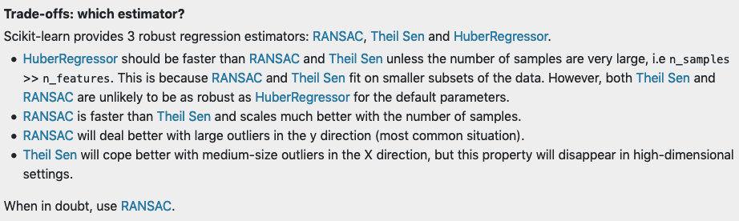

# Notes on Regularization and Bayesian Modeling

Avant Knowledge Sharing Session on 1/7/2019, Tuesday

- [Notes on Regularization and Bayesian Modeling](#notes-on-regularization-and-bayesian-modeling)
  - [1. Regularized (Linear) Regression](#1-regularized-linear-regression)
  - [2. Scikit-learn: Liner Models](#2-scikit-learn-liner-models)
    - [2.1. LASSO](#21-lasso)
    - [2.2. ElasticNet](#22-elasticnet)
    - [2.3. Least Angle Regression](#23-least-angle-regression)
    - [2.4. Orthogonal Matching Pursuit](#24-orthogonal-matching-pursuit)
    - [2.5. Bayesian Regression](#25-bayesian-regression)
    - [2.6. Automatic Relevance Determination (ARD)](#26-automatic-relevance-determination-ard)
    - [2.7. Logistic Regression](#27-logistic-regression)
    - [2.8. Robustness regression: outliers and modeling errors](#28-robustness-regression-outliers-and-modeling-errors)
      - [2.8.1. Random sample consensus (RANSAC)](#281-random-sample-consensus-ransac)
      - [2.8.2. Theil-Sen](#282-theil-sen)
      - [2.8.3. Huber regression](#283-huber-regression)
      - [2.8.4. Notes](#284-notes)
    - [2.9. Polynomial regression: extending linear models with basis functions](#29-polynomial-regression-extending-linear-models-with-basis-functions)
  - [3. References](#3-references)

## 1. [Regularized (Linear) Regression](http://uc-r.github.io/regularized_regression)

- Why regularization?
  - *Multicollinearity*. Coefficients for correlated features become over-inflated and can fluctuate significantly.  
  - *Insufficient Solution*. When $p > n$, the [solution matrix](https://en.wikipedia.org/wiki/Projection_matrix) (i.e., $\hat{\beta} =[(X^TX)^{-1}X^T]Y$) is invertible, which leads to non-unique solutions.
  - *Interpretability*. A smaller subset of strong features are usually preferred.
- [Ridge Regression](https://en.wikipedia.org/wiki/Tikhonov_regularization)
  - pushing correlated features towards each other rather than allowing for one to be wildly positive and the other wildly negative (as would have happened in OLS with correlated features). Reducing noice and identifying true signals in mdoel effects.
  - However, a ridge model will retain all variables. 
- [LASSO (least absolute shrinkage and selection operator)](https://en.wikipedia.org/wiki/Lasso_(statistics)) 
  - Similar to ridge, lasso pushes many collinear features towards each other rather than allowing for one to be wildly positive and the other negative. But lasso actually pushes coefficients to zero so it can be used for feature selection.
- Elastic Nets
  - The advantages of elastic net model is that it enables effective regularization via ridge penalty, and with feature selection characteristics of the lasso penalty.
- Alternatives
  - e.g., *Least Angle Regression*, *Bayesian Lasso*.

## 2. [Scikit-learn: Liner Models](https://scikit-learn.org/stable/modules/linear_model.html)

### 2.1. LASSO
- Example [Lasso model selection: Cross-Validation / AIC / BIC](https://scikit-learn.org/stable/auto_examples/linear_model/plot_lasso_model_selection.html#sphx-glr-auto-examples-linear-model-plot-lasso-model-selection-py)
- [LassoLarsIC](https://scikit-learn.org/stable/modules/generated/sklearn.linear_model.LassoLarsIC.html#sklearn.linear_model.LassoLarsIC) uses the Akaike information criterion (AIC) and the Bayes Information criterion (BIC) for model selection. It's computationally cheaper than using cross validation but assumes that the model is correct, i.e. that the data are actually generated by this model. Information-creteria based methods also tend to break when the problem is badly conditioned (e.g., more features than the number of samples).
- [MultiTaskLasso](https://scikit-learn.org/stable/modules/generated/sklearn.linear_model.MultiTaskLasso.html#sklearn.linear_model.MultiTaskLasso) is a model that estimates sparse coefficients for multiple regression problems jointly. The constraint is that the selected features are the same for all the regression problems, also called tasks. ***Is it gonna be useful for EDA in a multi-task setting?***

### 2.2. ElasticNet
- A similar suite of functions are available in scikit-learn, see [Lasso and Elastic Net for Sparse Signals](https://scikit-learn.org/stable/auto_examples/linear_model/plot_lasso_and_elasticnet.html#sphx-glr-auto-examples-linear-model-plot-lasso-and-elasticnet-py) and [MultiTaskElasticNet](https://scikit-learn.org/stable/modules/generated/sklearn.linear_model.MultiTaskElasticNet.html#sklearn.linear_model.MultiTaskElasticNet).

### 2.3. [Least Angle Regression](https://en.wikipedia.org/wiki/Least-angle_regression)
-  Similar to forward stepwise regression. At each step, it finds the feature most correlated with the target. When there are multiple features having equal correlation, instead of continuing along the same feature, it proceeds in a direction *equiangular* between the features.
-  [Pros and cons](https://en.wikipedia.org/wiki/Least-angle_regression#Pros_and_cons), and [step-by-step algorithm](https://en.wikipedia.org/wiki/Least-angle_regression#Algorithm).
-  [LassoLars](https://scikit-learn.org/stable/modules/generated/sklearn.linear_model.LassoLars.html#sklearn.linear_model.LassoLars) a lasso model implemented using the LARS algorithm as opposed to the implementation based on coordinate descent.

### 2.4. [Orthogonal Matching Pursuit](https://scikit-learn.org/stable/modules/linear_model.html#orthogonal-matching-pursuit-omp)
-  Example: [Sparse Signal Recovery With Orthogonal Matching Pursuit](https://scikit-learn.org/stable/auto_examples/linear_model/plot_omp.html#sphx-glr-auto-examples-linear-model-plot-omp-py)

$$\arg \min _\beta ||y - X\beta||_2^2 \quad \text{s.t.} \quad ||\beta||_0 \leq n_{\text{non-negative-coeff}}$$

-  OMP algorithm can be used for approximating the fit of a linear model with constraints imposed on the number of non-zero coefficients. 

### 2.5. [Bayesian Regression](https://scikit-learn.org/stable/modules/linear_model.html#bayesian-regression)
- [BayesianRidge](https://scikit-learn.org/stable/modules/generated/sklearn.linear_model.BayesianRidge.html#sklearn.linear_model.BayesianRidge) estimates a probabilistic model of the regression problem, with the prior distribution of the coefficients being $p(\omega|\lambda) = \mathcal{N}(\omega | 0, \lambda^{-1}\mathbf{I}_p)$, and $\alpha$ and $\gamma$ are chosen to follow the [Gamma distribution](https://en.wikipedia.org/wiki/Gamma_distribution) (conjugate prior for the precision of the Gaussian).
- Noted that in the Bayesian framework, hyperparameters are associated with parameters to the prior (i.e., Gamma, Gaussian) distributions.
- Example - [Curve Fitting with Bayesian Ridge Regression](https://scikit-learn.org/stable/auto_examples/linear_model/plot_bayesian_ridge_curvefit.html#sphx-glr-auto-examples-linear-model-plot-bayesian-ridge-curvefit-py).
- Bayesian Ridge Regression is more robust to ill-posed problems.

### 2.6. Automatic Relevance Determination (ARD)
 - Similar to Bayesian Ridge Regression, but poses to assumption of the Gaussian pior of weights being spherical. In ARD, weights have the following prior distribution:
$$p(\omega|\lambda) = \mathcal{N}(\omega | 0, A^{-1})$$ 

  where $\text{diag}(A) = \{\lambda_1, ..., \lambda_p\}$, i.e., axis-parallel, elliptical Gaussian distribution.

 - ARD can lead to *sparser* coefficietns.

### 2.7. Logistic Regression
- Regularization is applied by default in [`sklearn.linear_model.LogisticRegression`](https://scikit-learn.org/stable/modules/generated/sklearn.linear_model.LogisticRegression.html#sklearn.linear_model.LogisticRegression). The ElasticNet version of the cost function is as follows

$$\min_{\omega, c} \dfrac{1-\rho}{2}\omega^T\omega + \rho ||\omega||_1 + C \sum_{i=1}^n \log(\exp(-y_iX_i^T\omega+c) + 1)$$

where $\rho$ controls the $\ell_1$ vs. $\ell_2$ penalties, and $C$ controls the overall strength of regularization.

- Similar to ElasticNet for regression, [`sklearn.linear_model.LogisticRegressionCV`](https://scikit-learn.org/stable/modules/generated/sklearn.linear_model.LogisticRegressionCV.html#sklearn.linear_model.LogisticRegressionCV) implements Logistic Regression with built-in cross-validation support, to find the optimal $C$ and `l1_ratio` ($\rho$) parameters according to the `scoring` attribute.

### 2.8. [Robustness regression: outliers and modeling errors](https://scikit-learn.org/stable/modules/linear_model.html#robustness-regression-outliers-and-modeling-errors)

- Scikit-learn provides 3 robust regression estimators: [RANSAC](https://scikit-learn.org/stable/modules/linear_model.html#ransac-regression), [Theil Sen](https://scikit-learn.org/stable/modules/linear_model.html#theil-sen-regression) and [HuberRegressor](https://scikit-learn.org/stable/modules/linear_model.html#huber-regression). 

#### 2.8.1. Random sample consensus (RANSAC)
- [RANSAC](https://en.wikipedia.org/wiki/Random_sample_consensus) works as follows:
  - Fit a model from random subset to classify the complete dataset as inliers or outliers by calculating the residuals to the estimated model, where outliers are those with residuals $>$ `residual_threshold` (e.g., 1 standard deviation away from the mean error) 
  - Repeat the process until certain stopping creteria is met (i.e. `max_trials`, `stop_n_iniliers`, `stop_score`). 
  - Re-train the model (if necessary) with all the inliers (called *concensus set*). 
- scikit-learn example: [Robust linear model estimation using RANSAC](https://scikit-learn.org/stable/auto_examples/linear_model/plot_ransac.html#sphx-glr-auto-examples-linear-model-plot-ransac-py)
- **Thought: can we use XGBoost and RANSAC together, is it necessary for tree-based models?**

#### 2.8.2. Theil-Sen

- [Theil-Sen estimator](https://en.wikipedia.org/wiki/Theil%E2%80%93Sen_estimator) works by calculating the slopes and intercepts of a subpopulation of all possible combinations of $n_{\text{subsamples}}$ points. The final slope and intercept is then defined as the spatial median of these slopes and intercepts.
- In univariate setting (2-dimensional), the asymptotic efficiency of the Theil-Sen estimator is 29.3%, which means that it can tolerate arbitrary corrupted data of up to 29.3%.
- Theil-Sen loses its robustness properties in high dimensional problems.

#### 2.8.3. Huber regression
- Huber regression is a robust regression method that uses the [Huber loss](https://en.wikipedia.org/wiki/Huber_loss), which applies a linear loss (as opposed to quadratic loss) to samples that are classified as outliers (i.e., absolute error $> \epsilon$)
- In scikit-learn, the [`HuberRegressor`](https://scikit-learn.org/stable/modules/generated/sklearn.linear_model.HuberRegressor.html#sklearn.linear_model.HuberRegressor) minimizes the following loss function:

$$\min_{\omega, \sigma} \sum_{i=1}^n(\sigma + H_\epsilon(\frac{X_i\omega - y_i}{\sigma})\sigma) + \alpha ||\omega||_2^2$$

where 

$$H_\epsilon(z) = \begin{cases}
  z^2, & \text{if } |z| < \epsilon, \\
  2\epsilon|z| - \epsilon^2, & \text{otherwise}
\end{cases}$$

- Note that the formulation above garantees its scale-invariance with regards to $X$ and $y$.
- Scikit-learn example of [HuberRegressor vs Ridge on dataset with strong outliers](https://scikit-learn.org/stable/auto_examples/linear_model/plot_huber_vs_ridge.html#sphx-glr-auto-examples-linear-model-plot-huber-vs-ridge-py).

#### 2.8.4. Notes
- Choosing robust estimator (from scikit-learn)

- Robust fitting in high-dimensional setting (large `n_features`) is very hard

- Noted that the three methods mentioned only work for building robust linear models against outliers. **For outlier detection in general, check out [scikit-learn modules (2.7) - *Novelty and Outlier Detection*](https://scikit-learn.org/stable/modules/outlier_detection.html)**.

### 2.9. [Polynomial regression: extending linear models with basis functions](https://scikit-learn.org/stable/modules/linear_model.html#polynomial-regression-extending-linear-models-with-basis-functions)
- Polynomial regression is ***linear*** models trained on nonlinear functions of the original data, which is able to maintain the generally fast performance of linear methods while allowing them to fit a much wider range of data. 
- The [`PolynomialFeatures`](https://scikit-learn.org/stable/modules/generated/sklearn.preprocessing.PolynomialFeatures.html#sklearn.preprocessing.PolynomialFeatures) scikit-learn transformer can create higher powers (with `degree`) or interactions (with `interaction_only=True`) of the original features.

## 3. References
Two major documents that have been through

- [UC Business Analytics R Programming Guide - Regularized Regression](http://uc-r.github.io/regularized_regression)
- [Scikit-learn documentation - 1.1 Linear Models](https://scikit-learn.org/stable/modules/linear_model.html).

Notes and further readings on a variety of sub-topics.

- Automatic Relevance Determination
  - Christopher M. Bishop: Pattern Recognition and Machine Learning, Chapter 7.2.1
   - [David Wipf and Srikantan Nagarajan: A new view of automatic relevance determination](https://papers.nips.cc/paper/3372-a-new-view-of-automatic-relevance-determination.pdf)
- Logistic regression
  - [Liangjie Hong, Notes on Logistic Loss Function](http://www.hongliangjie.com/wp-content/uploads/2011/10/logistic.pdf)

